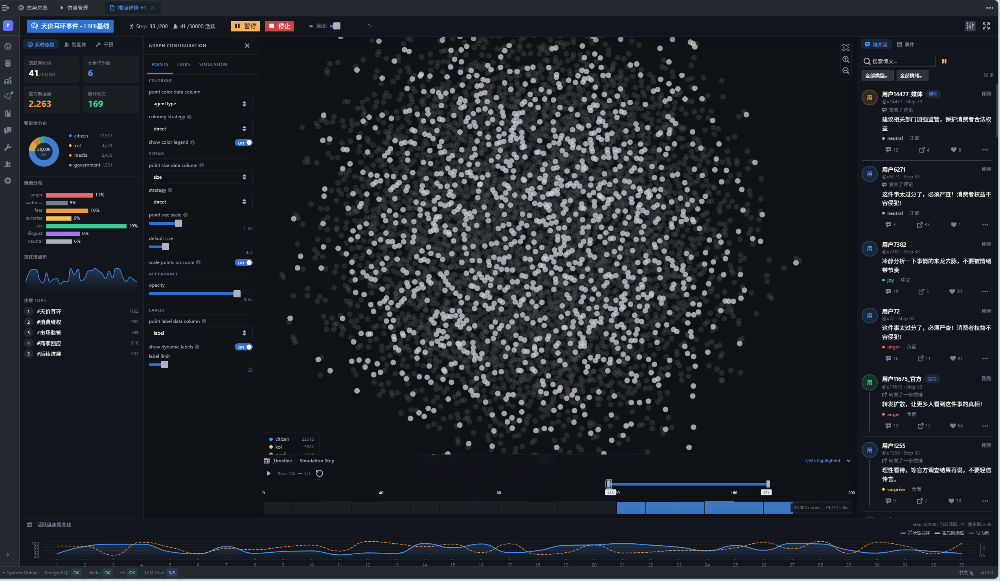
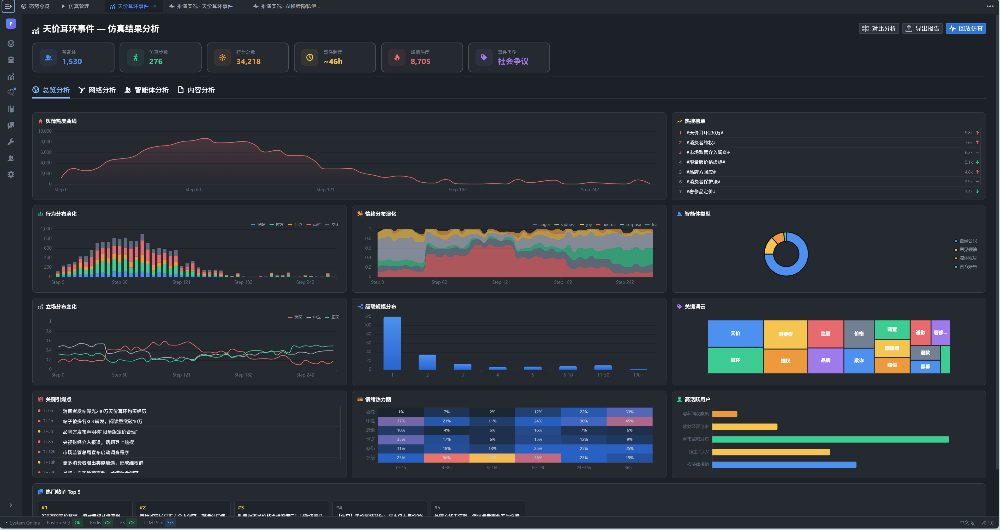

<p align="center">
  <a href="README_CN.md">中文</a> | <b>English</b>
</p>

<p align="center">
  
</p>

<h3 align="center">POSIM — A Multi-Agent Simulation Framework for Social Media Public Opinion Evolution and Governance</h3>

<p align="center">
  <em>"All models are wrong, but some are useful." — George E. P. Box</em>
</p>

<p align="center">
  <a href="https://www.python.org/downloads/"></a>
  <a href="https://opensource.org/licenses/MIT"></a>
  <a href="https://pytorch.org/"></a>
  <a href="https://openai.com/"></a>
</p>

---

<h2 align="center">
  🌐 <a href="https://DeepCogLab.github.io/posim/">https://DeepCogLab.github.io/posim/</a> 🌐
</h2>

<p align="center">
  <a href="https://DeepCogLab.github.io/posim/">
    
  </a>
</p>

<p align="center">
  📄 <a href="#">Paper (Under Review)</a> &nbsp;|&nbsp;
  🌐 <a href="https://DeepCogLab.github.io/posim/">Homepage</a> &nbsp;|&nbsp;
  🐛 <a href="https://github.com/DeepCogLab/posim/issues">Issues</a>
</p>

---

## 📖 Table of Contents

- [💡 Why POSIM?](#-why-posim)
- [✨ Key Features](#-key-features)
- [🏗️ Framework Overview](#%EF%B8%8F-framework-overview)
- [🌳 Project Structure](#-project-structure)
- [⚙️ Installation](#%EF%B8%8F-installation)
- [🚀 Quick Start](#-quick-start)
- [🔌 Extension Guide](#-extension-guide)
- [💾 Datasets & Ethics](#-datasets--ethics)
- [📄 License](#-license)
- [🚧 Online System — Coming Soon](#-online-system--coming-soon)

---

## 💡 Why POSIM?

Real-world public opinion events can sweep across social networks within hours. Understanding these complex collective dynamics is critical for social governance, crisis response, and public policy — yet real-world social experiments face fundamental challenges of ethical constraints and irreproducibility. Traditional simulation methods (epidemic models, threshold cascades, classic ABM) share a common bottleneck: **they cannot explicitly model individual cognitive processes**. Recent LLM-based approaches treat models as end-to-end behavior generators without modeling intermediate cognitive states, leaving behavioral mechanisms opaque.

**POSIM** (**P**ublic **O**pinion **Sim**ulator) addresses these challenges by embedding LLMs within a structured cognitive architecture, enabling agents to maintain explicit belief states and produce fully traceable behavioral decisions.

| **Platform** | **Explicit Cognitive Modeling** | **Validation (M/P/S)** | **Real-Case Intervention** | **LLM Multi-Type Agents** | **Temporal Precision** | **Modular Design** |
| :--- | :---: | :---: | :---: | :---: | :---: | :---: |
| S3 | ✗ | ✗/✓/✓ | ✗ | ✗ | ★★★ | ★★★ |
| HiSim | ✗ | ✗/✗/✓ | ✗ | ✗ | ★★ | ★★ |
| GA-S3 | ✗ | ✗/✗/✓ | ✗ | ✓ | ★★★ | ★★ |
| SPARK | ✗ | ✗/✓/✗ | ✗ | ✓ | ★★ | ★★ |
| FDE-LLM | ✗ | ✗/✗/✓ | ✗ | ✗ | ★★ | ★★ |
| TrendSim | ✗ | ✓/✗/✗ | ✗ | ✓ | ★★★★ | ★★★ |
| OASIS | ✗ | ✗/✓/✓ | ✗ | ✗ | ★★★★ | ★★★★ |
| LMAgent | ✗ | ✗/✗/✓ | ✗ | ✓ | ★★ | ★★ |
| **POSIM (Ours)** | **✓** | **✓/✓/✓** | **✓** | **✓** | **★★★★★** | **★★★★★** |

> *M = Mechanism validation; P = Phenomenon validation; S = Statistical validation.*

---

## ✨ Key Features

- 🧠 **Social-BDI Agent Architecture** — LLMs embedded in a layered cognitive framework (Perception → Belief → Desire → Intention → Action) with emotional arousal and cognitive biases. Three cognitive subsystems powered by independent LLM calls, fully traceable decision chains.

- ⏱️ **Hawkes Process-Driven Temporal Engine** — Hawkes self-exciting point process unifying exogenous event shocks and endogenous user interactions with circadian rhythm modulation, reproducing realistic "outbreak–sustain–decay" activity patterns at minute-level resolution.

- 🛡️ **Three-Tier Progressive Validation** — From individual behavioral mechanism calibration → collective phenomenon emergence → statistical consistency, establishing simulation credibility layer by layer.

- 🔌 **Highly Decoupled Modular Architecture** — Agents, environment, and evaluation modules communicate through standard interfaces — swap the cognitive architecture, temporal engine, or evaluation metrics independently.

---

## 🏗️ Framework Overview

<p align="center">
  
</p>
<p align="center"><b>Figure 1.</b> Overall architecture of POSIM.</p>

POSIM comprises three core components:

> **(1) Social-BDI Agents** — Four-layer hierarchical belief system (identity → psychology → event opinion → emotion), LLM-driven desire inference, and multi-level chain-of-thought intention planning. Four heterogeneous agent types (ordinary users, opinion leaders, media, governments) share the unified cognitive pipeline.
>
> **(2) Simulation Environment** — Hawkes point process temporal engine for non-stationary activation; virtual social media platform with personalized recommendation, three-layer social networks, and trending topics.
>
> **(3) Strategy Evaluation** — Intervenor (event injection, node control, platform policy), Simulator (checkpoint-based counterfactual trajectories), and Evaluator (multi-dimensional quantitative assessment across behavior, content, and topology layers).

### 🎭 Four Heterogeneous Agent Types

| Type | Role | Behavioral Traits | Typical Manifestation |
| --- | --- | --- | --- |
| 👤 **Ordinary Users** | Primary participants | Colloquial, fragmented, emotion-driven | Impulsive expression under high arousal |
| 🌟 **Opinion Leaders** | Key intermediaries (two-step flow) | Independent views, agenda-setting | Significant influence on downstream beliefs |
| 📰 **Media Accounts** | Information gathering & dissemination | Formal, restrained, timely | Information confirmation & agenda framing |
| 🏛️ **Governments** | Official stance & governance | Low frequency, high authority | Pivotal influence after event escalation |

> All behavioral patterns emerge autonomously through the Social-BDI pipeline — they are **not** preset by rules.

---

## 🌳 Project Structure

```
posim/
├── posim/                                 # Core Framework
│   ├── agents/                            # Agent Module
│   │   ├── base_agent.py                  # Base agent (cognitive pipeline scheduling)
│   │   ├── citizen_agent.py               # Ordinary user agent
│   │   ├── kol_agent.py                   # Opinion leader agent
│   │   ├── media_agent.py                 # Media agent
│   │   ├── government_agent.py            # Government agent
│   │   └── ebdi/                          # Social-BDI Cognitive Architecture
│   │       ├── belief/                    # Belief Subsystem
│   │       │   ├── belief_system.py       # Belief system orchestrator
│   │       │   ├── belief_updater.py      # LLM-driven belief update
│   │       │   ├── emotion_belief.py      # Emotional arousal belief
│   │       │   ├── event_belief.py        # Event opinion belief
│   │       │   ├── identity_belief.py     # Role identity belief
│   │       │   └── psychological_belief.py # Psychological cognition belief
│   │       ├── desire/                    # Desire Subsystem
│   │       │   ├── desire_system.py       # Motivation inference engine
│   │       │   └── desire_types.py        # Predefined motivation types
│   │       ├── intention/                 # Intention Subsystem
│   │       │   └── intention_system.py    # Multi-level chain-of-thought planning
│   │       └── memory/                    # Streaming Memory
│   │           ├── memory_retrieval.py    # Recency-relevance retrieval scoring
│   │           └── stream_memory.py       # Time-decayed memory store
│   ├── config/                            # Configuration
│   │   ├── config_manager.py              # Configuration loader
│   │   └── config_schema.py              # Dataclass configuration schema
│   ├── data/                              # Data Management
│   │   ├── data_loader.py                 # Data loading utilities
│   │   └── preprocessor.py               # Data preprocessing
│   ├── engine/                            # Simulation Engine
│   │   ├── simulator.py                   # Main simulation loop (async concurrent)
│   │   ├── hawkes_process.py              # Hawkes self-exciting point process
│   │   └── time_engine.py                # Temporal engine (circadian modulation)
│   ├── environment/                       # Simulation Environment
│   │   ├── recommendation.py              # Dual-channel content recommendation
│   │   ├── social_network.py              # Three-layer directed social network
│   │   ├── hot_search.py                  # Trending topics
│   │   └── event_queue.py                # External event queue
│   ├── evaluation/                        # Evaluation Framework
│   │   ├── base.py                        # Base evaluator class
│   │   ├── data_loader.py                 # Evaluation data loader
│   │   ├── evaluator_manager.py           # Evaluation orchestrator
│   │   ├── utils.py                       # Evaluation utilities
│   │   ├── visualization.py               # Visualization tools
│   │   ├── calibration/                   # Statistical Calibration
│   │   │   ├── behavior.py               # Behavior layer (JSD, ρ, RMSE)
│   │   │   ├── emotion.py                # Emotion calibration
│   │   │   ├── hotness.py                # Hotness curve calibration
│   │   │   ├── network.py                # Network topology & cascade
│   │   │   ├── opinion_index.py          # Discourse irrationality index
│   │   │   └── topic.py                  # Topic analysis
│   │   └── mechanism/                     # Phenomenon Emergence Validation
│   │       ├── agent_behavior.py          # Agent behavior analysis
│   │       ├── lifecycle.py               # Opinion lifecycle analysis
│   │       ├── macro_phenomenon.py        # Macro phenomenon validation
│   │       ├── opinion_polarization.py    # Polarization analysis
│   │       └── propagation_structure.py   # Cascade & network structure
│   ├── llm/                               # LLM Resource Management
│   │   ├── api_pool.py                    # Multi-endpoint pool (load balancing, failover)
│   │   └── llm_client.py                 # Unified LLM call client
│   ├── micro_user_vail/                   # Individual Behavior Mechanism Validation
│   │   ├── main.py                        # Validation entry point
│   │   ├── config.py                      # Validation configuration
│   │   ├── data_loader.py                 # Validation data loader
│   │   ├── llm_service.py                 # LLM service for validation
│   │   ├── simulation.py                  # Validation simulation runner
│   │   ├── validation.py                  # Validation metrics computation
│   │   └── prompts.py                     # Validation prompts
│   ├── prompts/                           # Prompt Templates (per agent type)
│   │   ├── prompt_loader.py               # Dynamic prompt loader
│   │   ├── ablation_prompts.py            # Ablation experiment prompts
│   │   ├── citizen_prompts/               # Ordinary user prompts
│   │   │   ├── belief_prompts.py
│   │   │   ├── desire_prompts.py
│   │   │   └── intention_prompts.py
│   │   ├── kol_prompts/                   # Opinion leader prompts
│   │   ├── media_prompts/                 # Media prompts
│   │   └── government_prompts/            # Government prompts
│   ├── storage/                           # Data Storage
│   │   ├── database.py                    # SQLite database
│   │   └── log_manager.py                # Simulation logging
│   ├── web/                               # Real-time Monitoring
│   │   ├── websocket_server.py            # WebSocket server for live monitoring
│   │   └── monitor.html                   # Monitoring dashboard
│   └── utils/                             # Utility Helpers
│       ├── formatters.py                  # Prompt context formatters
│       └── logger.py                      # Logging utilities
├── scripts/                               # Simulation & Evaluation Scripts
│   ├── run_all_evaluations.py             # Batch evaluation across all events
│   ├── run_ablation_batch.py              # Batch ablation experiments
│   ├── extract_all_metrics.py             # Extract metrics summary
│   ├── extract_ablation_metrics.py        # Extract ablation metrics
│   ├── tianjiaerhuan/                     # LE — Luxury Earring Event
│   │   ├── run_with_monitor.py            # Run simulation with live monitoring
│   │   ├── evaluate.py                    # Run evaluation pipeline
│   │   ├── config.json                    # Simulation configuration
│   │   ├── config_*.json                  # Ablation configurations
│   │   └── data/                          # Event data (users, posts, events, relations)
│   ├── wudatushuguan/                     # WL — WHU Library Event
│   │   ├── run_with_monitor.py
│   │   ├── evaluate.py
│   │   ├── visualize_network.py           # Network visualization
│   │   └── data/
│   └── xibeiyuzhicai/                     # XF — Xibei Prepared Food Event
│       ├── run_with_monitor.py
│       ├── evaluate.py
│       └── data/
├── docs/                                  # Project Homepage (GitHub Pages)
├── assets/                                # Static Resources (logo, figures)
└── requirements.txt                       # Python dependencies
```

---

## ⚙️ Installation

### 💻 System Requirements

| Item | Minimum | Recommended |
| --- | --- | --- |
| Python | ≥ 3.8 | 3.10 |
| CUDA | — | ≥ 11.0 (local embedding acceleration) |
| RAM | 16 GB | 32 GB+ (large-scale simulation) |
| GPU | — | Recommended (sentence-transformers acceleration) |

### 📦 Setup

```bash
git clone https://github.com/DeepCogLab/posim.git
cd posim

# Recommended: use conda
conda create -n posim python=3.10
conda activate posim

pip install -r requirements.txt
```

### 📚 Core Dependencies

| Package | Version | Purpose |
| --- | --- | --- |
| `numpy` | ≥ 1.24.0 | Numerical computation, Hawkes process sampling |
| `openai` | ≥ 1.0.0 | LLM API calls (OpenAI-compatible interface) |
| `pydantic` | ≥ 2.0.0 | Configuration validation & structured data |
| `sentence-transformers` | ≥ 2.2.0 | Semantic embeddings (recommendation, dedup, memory) |
| `torch` | ≥ 2.0.0 | Deep learning backend (embedding inference) |
| `matplotlib` | ≥ 3.7.0 | Evaluation visualization |
| `neo4j` | ≥ 5.0.0 | Social network graph database (optional) |
| `websockets` | ≥ 12.0 | Real-time simulation monitoring |

---

## 🚀 Quick Start

### 1️⃣ Configure LLM

POSIM supports **any OpenAI-compatible API service**. Configure the LLM endpoint in your simulation config file (e.g., `scripts/tianjiaerhuan/config.json`):

#### 🔹 Option A: Local Deployment (vLLM / Ollama)

Deploy a model locally using [vLLM](https://github.com/vllm-project/vllm), [Ollama](https://ollama.com/), or any OpenAI-compatible local server:

```json
{
  "llm": {
    "max_concurrent_requests": 30,
    "use_local_embedding_model": true,
    "local_embedding_model_path": "path/to/bge-small-zh-v1.5",
    "embedding_dimension": 512,
    "embedding_device": "cuda",
    "llm_api_configs": [
      {
        "name": "local-qwen",
        "enabled": true,
        "base_url": "http://localhost:8000/v1/",
        "api_key": "not-needed",
        "model": "Qwen/Qwen2.5-14B-Instruct",
        "temperature": 0.7,
        "top_p": 0.9,
        "weight": 1.0
      }
    ]
  }
}
```

#### 🔹 Option B: Cloud API Service

Use any cloud provider that offers an OpenAI-compatible API (OpenAI, DeepSeek, etc.):

```json
{
  "llm": {
    "max_concurrent_requests": 30,
    "use_local_embedding_model": true,
    "local_embedding_model_path": "path/to/bge-small-zh-v1.5",
    "embedding_dimension": 512,
    "embedding_device": "cuda",
    "llm_api_configs": [
      {
        "name": "cloud-api",
        "enabled": true,
        "base_url": "https://api.your-provider.com/v1/",
        "api_key": "sk-your-api-key",
        "model": "your-model-name",
        "temperature": 0.7,
        "top_p": 0.9,
        "weight": 1.0
      }
    ]
  }
}
```

> 💡 **Multi-endpoint support**: Configure multiple endpoints in `llm_api_configs` — the framework manages them through a unified API pool with round-robin load balancing, per-purpose model routing (belief/desire/intention), concurrency control, and automatic failover.

### 2️⃣ Prepare Data

Each simulation scenario requires four data files under `scripts/<event>/data/`:

| File | Contents |
| --- | --- |
| `users.json` | User profiles (ID, nickname, gender, followers, verification type, description, historical behavior summary) |
| `events.json` | External event sequence (injection time, event description, impact intensity) |
| `initial_posts.json` | Initial post data (content, author, timestamp, type, keywords) |
| `relations.json` | User follow relationships |

### 3️⃣ Run Simulation

```bash
python scripts/tianjiaerhuan/run_with_monitor.py
```

The simulation will: load user data → initialize Social-BDI belief system → build social network & recommendation system → start Hawkes temporal engine → execute cognitive pipeline per step (async concurrent) → run emotion contagion → update trending topics. Supports **WebSocket real-time monitoring dashboard**.

### 4️⃣ Evaluate

```bash
python scripts/tianjiaerhuan/evaluate.py
```

Evaluation outputs are saved to `vis_results/`, including behavior calibration, hotness calibration, emotion calibration, network topology visualizations, and a comprehensive `evaluation_report.json`.

<details>
<summary><b>📋 Full Configuration Parameters</b></summary>

| Parameter | Description | Default |
| --- | --- | :---: |
| `time_granularity` | Simulation time step (minutes) | 10 |
| `hawkes_mu` | Hawkes background rate | 0.01 |
| `hawkes_internal.alpha` | Endogenous excitation intensity | 0.005 |
| `hawkes_internal.beta` | Endogenous decay rate | 0.16 |
| `hawkes_external.alpha` | Exogenous excitation intensity | 0.08 |
| `hawkes_external.beta` | Exogenous decay rate | 0.005 |
| `total_scale` | Activity scaling factor | 2000 |
| `circadian_strength` | Circadian rhythm modulation strength | 0.3 |
| `recommend_count` | Recommended items per step | 10 |
| `comment_count` | Displayed comments per post | 5 |
| `homophily_weight` | Recommendation homophily weight | 0.3 |
| `popularity_weight` | Recommendation popularity weight | 0.3 |
| `recency_weight` | Recommendation freshness weight | 0.4 |
| `exploration_rate` | Recommendation exploration rate | 0.2 |
| `relation_weight` | Relationship channel weight | 0.5 |
| `hot_search_update_interval` | Trending update interval (minutes) | 15 |

</details>

---

## 🔌 Extension Guide

Thanks to the highly decoupled modular design, POSIM's core components can be independently replaced and extended through standard interfaces.

<details>
<summary><b>➕ Add a New Agent Type</b></summary>

1. Inherit `BaseAgent` in `posim/agents/` to create a new class
2. Create corresponding role prompt templates in `posim/prompts/` (belief / desire / intention)
3. Register the new type in the simulation configuration

</details>

<details>
<summary><b>🔄 Replace the Cognitive Architecture</b></summary>

The three Social-BDI subsystems communicate through structured intermediate states and can be independently replaced:

- Belief subsystem: `posim/agents/ebdi/belief/`
- Desire subsystem: `posim/agents/ebdi/desire/`
- Intention subsystem: `posim/agents/ebdi/intention/`

Simply maintain the same input/output format.

</details>

<details>
<summary><b>⏱️ Switch the Temporal Engine</b></summary>

Implement a new temporal engine module in `posim/engine/`, following the same intensity computation and agent sampling interface.

</details>

<details>
<summary><b>📊 Add Evaluation Metrics</b></summary>

Add a new evaluator class in `posim/evaluation/calibration/` or `posim/evaluation/mechanism/`, and register it in `evaluator_manager.py`.

</details>

<details>
<summary><b>🔗 Connect a New LLM Service</b></summary>

Simply add a new endpoint in the `llm_api_configs` configuration — the framework uses a unified OpenAI-compatible interface, no code changes needed. Supports local deployments (vLLM, Ollama), OpenAI, and other cloud API services.

</details>

---

## 💾 Datasets & Ethics

Experiments are based on three representative public opinion events collected from the Sina Weibo platform:

| Event | Code | Category | #Users | #Posts | Duration |
| --- | :---: | --- | :---: | :---: | :---: |
| **Luxury Earring** — Jewelry worn by a public figure identified as luxury item | LE | Social Controversy | 1,530 | 34,218 | ~46h |
| **WHU Library** — Reported harassment incident; court verdict reignited discourse | WL | Campus Incident | 1,843 | 51,647 | ~190h |
| **Xibei Prepared Food** — Allegations of prepared food use in restaurant chain | XF | Food Safety | 1,987 | 14,892 | ~71h |

### ⚠️ Ethical Statement & Data Access

> **This study is conducted purely as data-driven scientific research. All events are analyzed based entirely on publicly available data, and the authors hold no opinions or positions regarding any events, individuals, or organizations involved. The simulation framework is intended exclusively for academic research and methodological validation.**

📌 All datasets are collected from publicly available posts on Sina Weibo. Due to the sensitive nature of social media data, we do **not** provide open downloads. For academic research access, please contact: 📮 **15939048354@163.com**

---

## 📄 License

This project is open-sourced under the [MIT License](LICENSE).

---

## 🚧 Online System — Coming Soon

🔥 **A full-featured online public opinion simulation system is under active development!** The system will provide an end-to-end pipeline covering **public opinion sensing → analysis → simulation & forecasting**, enabling researchers and practitioners to conduct computational experiments directly from a web interface.

If you are interested in this project and would like to contribute to its development, we warmly welcome you to join us! Feel free to reach out via email: **15939048354@163.com**

<p align="center">
  &nbsp;&nbsp;&nbsp;&nbsp;
  
</p>
<p align="center"><em>🖼️ Early-stage system demo prototypes — the official system is coming soon, stay tuned!</em></p>

---

<p align="center">
  <i>Questions or suggestions? Feel free to open an <a href="https://github.com/DeepCogLab/posim/issues">Issue</a> 💬</i>
</p>
