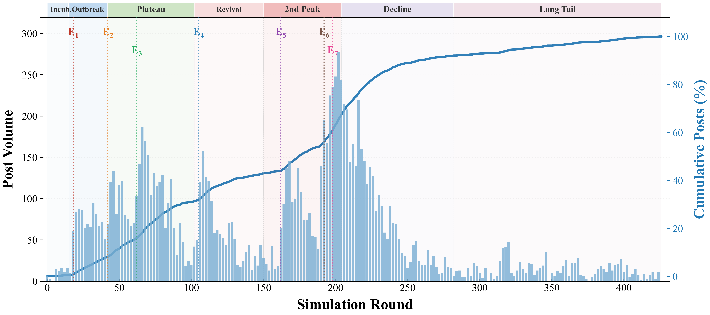
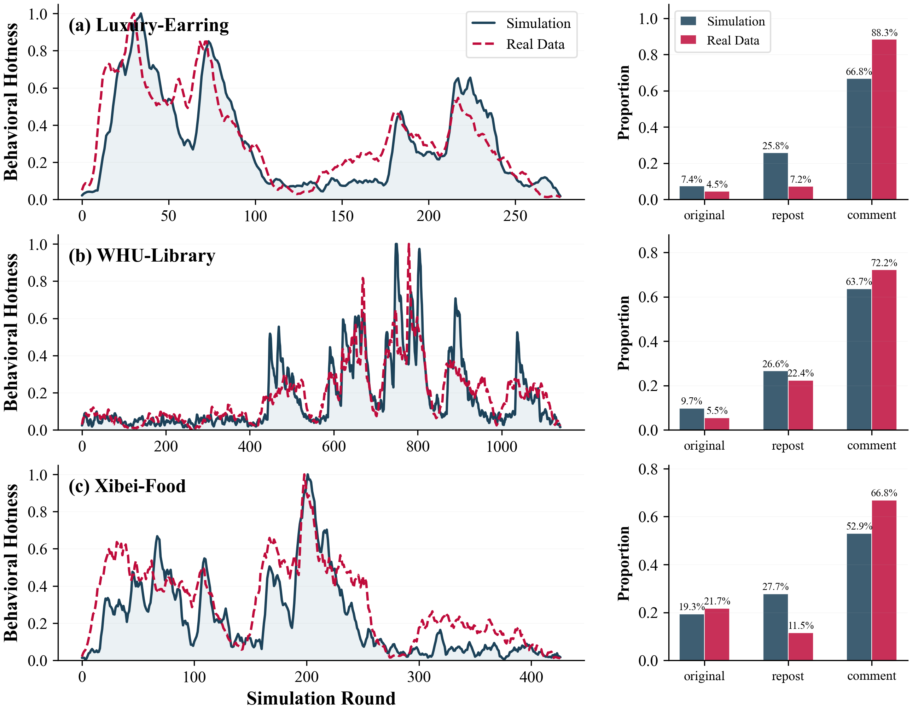

<p align="center">
  <b>中文</b> | <a href="README.md">English</a>
</p>

<p align="center">
  
</p>

<h3 align="center">POSIM — 面向社交媒体舆情演化与治理的多智能体仿真框架</h3>

<p align="center">
  <em>"所有模型都是错误的，但其中一些是有用的。" — George E. P. Box</em>
</p>

<p align="center">
  <a href="https://www.python.org/downloads/"></a>
  <a href="https://opensource.org/licenses/MIT"></a>
  <a href="https://pytorch.org/"></a>
  <a href="https://openai.com/"></a>
</p>

---

<h2 align="center">
  🌐 <a href="https://DeepCogLab.github.io/posim/">https://DeepCogLab.github.io/posim/</a> 🌐
</h2>

<p align="center">
  <a href="https://DeepCogLab.github.io/posim/">
    
  </a>
</p>

<p align="center">
  📄 <a href="#">论文（审稿中）</a> &nbsp;|&nbsp;
  🌐 <a href="https://DeepCogLab.github.io/posim/">主页</a> &nbsp;|&nbsp;
  🐛 <a href="https://github.com/DeepCogLab/posim/issues">Issues</a>
</p>

---

## 📖 目录

- [💡 为什么选择 POSIM？](#-为什么选择-posim)
- [✨ 核心贡献](#-核心贡献)
- [🏗️ 框架总览](#%EF%B8%8F-框架总览)
- [🧠 Social-BDI 智能体架构](#-social-bdi-智能体架构)
- [🌍 仿真环境](#-仿真环境)
- [🧪 策略评估](#-策略评估)
- [🛡️ 三层递进验证](#%EF%B8%8F-三层递进验证)
- [💾 数据集](#-数据集)
- [📊 实验结果](#-实验结果)
- [🌳 项目结构](#-项目结构)
- [⚙️ 安装配置](#%EF%B8%8F-安装配置)
- [🚀 快速开始](#-快速开始)
- [🔌 扩展指南](#-扩展指南)
- [📄 许可证](#-许可证)
- [🚧 在线系统 — 敬请期待](#-在线系统--敬请期待)

---

## 💡 为什么选择 POSIM？

一起突发事件可以在数小时内席卷社交网络——成千上万的用户涌入评论区，情绪在转发链中不断升级，一位意见领袖的发文就可能重塑公众舆论。理解和预判这些复杂的集体动力学对于社会治理、危机应对和公共政策具有关键价值。

然而，真实世界的社会实验面临伦理约束和不可复现性的根本挑战。传统计算仿真方法——无论是传染病模型、阈值级联模型，还是经典的基于智能体建模（ABM）——各有所长，但共同面临一个瓶颈：**无法显式建模个体的认知过程**。规则驱动的智能体既无法感知复杂的环境信息，也无法模拟情绪演化、动机推理和自主决策。

大语言模型（LLM）的最新突破带来了新的可能——语义理解、上下文推理和自主决策能力使仿真智能体能够真正"理解"事件并做出类人决策。然而现有大多数工作将 LLM 视为端到端的行为生成器，未显式建模中间认知状态，导致长程仿真中行为机制不透明。

**POSIM**（**P**ublic **O**pinion **Sim**ulator，舆情仿真器）正是为解决这些挑战而设计的。

| **平台** | **显式认知建模** | **验证体系 (M/P/S)** | **真实事件干预** | **LLM多类型智能体** | **时间精度** | **模块化设计** |
| :--- | :---: | :---: | :---: | :---: | :---: | :---: |
| S3 | ✗ | ✗/✓/✓ | ✗ | ✗ | ★★★ | ★★★ |
| HiSim | ✗ | ✗/✗/✓ | ✗ | ✗ | ★★ | ★★ |
| GA-S3 | ✗ | ✗/✗/✓ | ✗ | ✓ | ★★★ | ★★ |
| SPARK | ✗ | ✗/✓/✗ | ✗ | ✓ | ★★ | ★★ |
| FDE-LLM | ✗ | ✗/✗/✓ | ✗ | ✗ | ★★ | ★★ |
| TrendSim | ✗ | ✓/✗/✗ | ✗ | ✓ | ★★★★ | ★★★ |
| OASIS | ✗ | ✗/✓/✓ | ✗ | ✗ | ★★★★ | ★★★★ |
| LMAgent | ✗ | ✗/✗/✓ | ✗ | ✓ | ★★ | ★★ |
| **POSIM（本框架）** | **✓** | **✓/✓/✓** | **✓** | **✓** | **★★★★★** | **★★★★★** |

> *M = 机制验证；P = 现象验证；S = 统计验证。*

---

## ✨ 核心贡献

1. 🧠 **Social-BDI 智能体架构** — 将 LLM 嵌入分层认知框架（感知 → 信念 → 欲望 → 意图 → 行为），融合情绪激发和认知偏差。三个认知子系统各自由独立 LLM 调用驱动，通过结构化中间状态通信。整个行为生成过程完全可追溯——不再是"提示输入、答案输出"的黑盒。

2. ⏱️ **Hawkes 过程驱动的仿真环境** — Hawkes 自激点过程统一了外生事件冲击（突发新闻、官方声明）与内生用户交互（转发和评论的滚雪球效应），结合昼夜节律调制，以分钟级时间分辨率再现非平稳的"爆发-持续-衰退"活跃模式。

3. 🛡️ **三层递进验证框架** — 借鉴仿真工程经典 V&V 原则，验证从个体行为机制校准 → 群体现象涌现校准 → 统计结果一致性校准逐层递进，逐层建立仿真可信度。

4. 🔌 **高度解耦的模块化架构** — 智能体、仿真环境和策略评估通过标准接口通信，可独立替换——更换认知架构、更换时间引擎或添加新评估指标，无需触及其他模块。

---

## 🏗️ 框架总览

<p align="center">
  
</p>
<p align="center"><b>图 1.</b> POSIM 总体架构。Social-BDI 智能体架构实现认知管线（左）；基于 Hawkes 过程的时间引擎与虚拟社交媒体平台构成仿真环境（中上）；策略评估模块支持反事实治理评估（右下）。</p>

POSIM 由三大核心组件协同工作：

> **（1）Social-BDI 智能体** — 基于 BDI 认知架构融合情绪激发和认知偏差，从真实用户数据和 LLM 驱动的结构化访谈生成多类型智能体（普通用户、意见领袖、媒体账号、政府）。每个智能体维护从角色身份信念到实时情绪激发的完整认知状态。
>
> **（2）仿真环境** — Hawkes 自激点过程时间引擎控制智能体激活时序；虚拟社交媒体平台提供个性化推荐、社交网络和热搜话题，构成智能体感知和交互的虚拟世界。
>
> **（3）策略评估** — 干预器、仿真器和评估器三模块协同工作，支持事件注入、节点控制和平台策略干预。检查点回调生成平行演化轨迹，实现反事实推理。

---

## 🧠 Social-BDI 智能体架构

传统反应式智能体不过是无状态的行为生成器——给定输入产生输出，无法洞察中间过程。POSIM 采取根本不同的方式：基于经典 BDI 认知架构，融合情绪激发和认知偏差，构建具有**显式认知状态**和**可审计多阶段决策链**的智能体。认知管线形式化为：

$$
\text{感知}(P_t) \;\to\; \text{信念}(B_t) \;\to\; \text{欲望}(D_t) \;\to\; \text{意图}(I_t) \;\to\; \text{行为}(A_t)
$$

### 💭 信念子系统 — 智能体如何"理解世界"

心理学研究表明，不同认知层具有不同的稳定性——核心人格特质在短期内高度稳定，而对特定事件的即时情绪则随信息输入快速变化。基于这种认知分层，POSIM 设计了四层层次化信念系统：

```
  ┌──────────────────────────────────────────────────────────────────────┐
  │  B^id  — 角色身份信念     性别、地区、职业、粉丝数                      │  ← 固定（人格锚点）
  │  B^psy — 心理认知信念     从众、偏见、宣泄                             │  ← 高度稳定
  │  B^evt — 事件观点信念     对各方的立场与推理                            │  ← 随新信息演化
  │  B^emo — 情绪激发信念     [快乐, 悲伤, 愤怒, 恐惧, ...]               │  ← 实时波动
  └──────────────────────────────────────────────────────────────────────┘
                              ▲  修改难度递减  ▼
```

关键设计亮点：

- **心理认知初始化** — 基于真实舆情事件分析，识别出代表性心理类型（自我实现型、猎奇求知型、宣泄释压型、反权威型、从众跟风型），每种类型包含约30条从真实数据提炼的认知条目。初始化时 LLM 根据用户历史行为匹配最佳拟合画像。
- **事件观点提取** — LLM 驱动的结构化访谈，每条观点存储为 $\langle t, \text{主体}, \text{观点}, \text{原因} \rangle$ 结构化四元组。
- **三机制情绪动力学** — 时间衰减（$\mathbf{e}(t) = \mathbf{e}(t_0) \cdot e^{-\lambda_e(t-t_0)}$）、内容刺激和邻居间社会传染（$(1-\rho) \cdot \mathbf{e}_i + \rho \cdot \bar{\mathbf{e}}_{\text{neighbor}}$）。
- **显式认知偏差注入** — 确认偏差、锚定效应、情绪驱动推理和简单归因倾向通过提示注入信念更新过程，模拟真实用户认知中的系统性偏差。

### 🎯 欲望子系统 — 智能体"想做什么"

社交媒体用户的参与动机高度多样——有人宣泄愤怒，有人寻求信息，有人仅仅是随大流。欲望子系统利用 LLM 常识推理自动推断行为动机，输出带强度权重的动机列表：

> *情绪宣泄（高）* · *正义倡导（中）* · *自我表达（低）* · *信息获取（极低）* · ...

动机列表约束下游意图规划——当情绪宣泄主导时，智能体倾向于产生情绪强烈的短评论；当信息获取主导时，智能体更可能转发评论或发表长篇分析。

### 🛠️ 意图子系统 — 智能体如何"执行行动"

不同于传统单步行为生成，意图子系统采用**多层级思维链**进行渐进式决策：

```
  L1 — 做什么 & 对谁
    从原子操作中选择（点赞/转发/转发评论/短评/长评/短原创/长原创），确定交互目标

  L2 — 如何表达
    四个正交维度：情绪（类型+强度）× 立场（支持/反对/中立）
    × 风格（理性/讽刺/激进/共情/质疑）
    × 叙事（事实陈述/标签化/号召/权威引用）

  L3 — 具体说什么
    受 L1 + L2 约束，生成匹配智能体角色特征的文本
```

这种分解为内容生成提供了**显式策略约束**，防止 LLM 生成平淡、均质化的文本。每个决策都被记录以实现完全可追溯。

### 🎭 四种异质智能体类型

真实舆情涉及多种参与者类型的复杂交互。四种类型共享统一的 Social-BDI 认知管线，行为差异仅源于差异化的角色引导提示：

| 类型 | 角色 | 行为特征 | 典型表现 |
| --- | --- | --- | --- |
| 👤 **普通用户** | 主要参与者 | 口语化、碎片化、情绪驱动 | 高激发下的冲动表达 |
| 🌟 **意见领袖** | 关键中介（两级传播） | 独立见解、议程设置 | 显著影响下游用户信念 |
| 📰 **媒体账号** | 信息采集与传播 | 正式、克制、及时 | 信息确认与议程框架 |
| 🏛️ **政府** | 官方立场与治理 | 低频但高权威 | 事件升级后产生关键影响 |

> 四种类型的行为模式**不是预设的**，而是通过 Social-BDI 管线在角色引导提示约束下自主涌现的。

---

## 🌍 仿真环境

### ⏱️ Hawkes 点过程时间引擎

真实舆情活跃度呈现高度非均匀的时间分布——突发新闻可在数分钟内触发数千次转发，而平静期活跃度急剧下降。传统固定步长激活无法再现这些事件驱动的活跃涌现。

POSIM 采用 Hawkes 自激点过程建模集体活跃强度。核心直觉类似于"传染"：每次事件发生短暂提高后续事件的发生概率，如同一条爆款帖子在短期内刺激更多参与。

$$
\lambda(t) = \underbrace{\mu}_{\text{背景速率}} + \underbrace{\sum \alpha_{ext} e^{-\beta_{ext}(t - t_i)}}_{\text{外生激发（强·慢衰减）}} + \underbrace{\sum \alpha_{int} e^{-\beta_{int}(t - t_j)}}_{\text{内生激发（弱·快衰减）}}
$$

| 参数 | 符号 | 默认值 | 说明 |
| --- | --- | :---: | --- |
| 背景速率 | $\mu$ | 0.01 | 舆情平静期的基线发帖行为 |
| 外生激发强度 | $\alpha_{ext}$ | 0.08 | 突发新闻、官方声明的影响 |
| 外生衰减速率 | $\beta_{ext}$ | 0.005 | 外部事件影响的持续时间 |
| 内生激发强度 | $\alpha_{int}$ | 0.005 | 用户交互的滚雪球效应 |
| 内生衰减速率 | $\beta_{int}$ | 0.16 | 短期交互刺激衰减 |
| 昼夜节律幅度 | $s_{circ}$ | 0.3 | 深夜时段自然活跃度下降 |

### 📱 虚拟社交媒体平台

时间引擎确定每步激活哪些智能体后，虚拟平台决定**他们看到什么**和**什么吸引他们**：

- 🔗 **社交网络** — 三层有向结构：关注网络（静态基础设施）、实时转发网络和实时评论网络（仿真过程中动态增长）。

- 📋 **内容推荐** — 双通道检索（关系通道 + 公域通道），三维加权评分：

$$
S_{exp}(u, p) = \alpha \cdot H(u, p) + \beta \cdot P(p) + \gamma \cdot R(p)
$$

> 其中 $H$ = 同质性（语义相似度），$P$ = 热度（互动信号），$R$ = 新鲜度（时间衰减）。探索槽位打破信息茧房；历史机制防止重复曝光。嵌入模型：[BGE-small-zh-v1.5](https://huggingface.co/BAAI/bge-small-zh-v1.5)（余弦去重阈值 0.92）。

- 🔥 **热搜话题** — 自动追踪话题热度，结合互动信号与时间衰减定期更新排名，模拟真实平台热搜的注意力聚焦放大效应。

---

## 🧪 策略评估

POSIM 不仅是仿真器——它还是治理策略评估的**计算实验平台**。决策者经常问："如果我们采取某种干预措施，舆情轨迹将如何变化？"

```
         ┌─────────────┐        ┌─────────────┐        ┌─────────────┐
         │   干预器      │  ──→  │   仿真器      │  ──→  │   评估器      │
         └──────┬───────┘        └──────┬───────┘        └──────┬───────┘
                │                       │                       │
     ┌──────────┼──────────┐    检查点回调 →               热度曲线
     │          │          │    平行轨迹                   情感分布
   事件队列   节点控制   平台策略   ↓ 反事实推理           观点分布
                                                        ↓ 多维评估
```

- 🎯 **干预器** — 三种注入粒度：事件队列（如注入官方声明）、节点控制（如修改特定KOL的信念状态）、平台策略（如调整推荐权重或限制传播范围）
- 🔄 **仿真器** — 检查点回调定期保存完整状态快照；从任意检查点加载不同干预方案，生成平行演化轨迹进行反事实对比
- 📊 **评估器** — 与仿真引擎完全解耦；通过标准接口读取仿真日志进行多维定量评估

---

## 🛡️ 三层递进验证

借鉴仿真工程经典 V&V（验证与确认）原则，POSIM 建立了跨越**机制 → 现象 → 统计**的递进式验证框架：

```
  ╔═══════════════════════════════════════════════════╗
  ║  第一层：个体行为机制验证                            ║  ← "我们是否正确构建了模型？"
  ║  · 认知-行为链一致性 (0–5)                          ║
  ║  · 人格稳定性 (0–1)                                ║
  ║  · 决策鲁棒性 (0–1)                                ║
  ╠═══════════════════════════════════════════════════╣
  ║  第二层：群体现象涌现验证                            ║  ← 微观机制是否自发产生
  ║  · 舆情生命周期                                     ║    理论预测的宏观模式？
  ║  · 多智能体行为异质性                                ║
  ║  · 情绪激发与极化                                   ║
  ║  · 无标度拓扑与级联幂律                              ║
  ╠═══════════════════════════════════════════════════╣
  ║  第三层：统计结果一致性验证                           ║  ← "模型的结果是否准确？"
  ║  · 行为层：3项指标                                  ║
  ║  · 内容层：3项指标                                  ║
  ║  · 拓扑层：3项指标                                  ║
  ╚═══════════════════════════════════════════════════╝
```

第三层涵盖行为、内容、拓扑三层的 **9 项量化指标**：

| 层级 | 指标 | 说明 |
| --- | --- | --- |
| **行为层** | BType JSD ↓ | 行为类型分布的 Jensen-Shannon 散度 |
| | Act. ρ ↑ | 行为热度曲线的 Pearson 相关系数 |
| | Act. RMSE ↓ | 热度曲线的均方根误差 |
| **内容层** | Irrat. Sim. ↑ | 话语非理性分布相似度（非理性/理性/中立） |
| | \|ΔTTR\| ↓ | 词汇多样性偏差（类型-标记比） |
| | \|ΔS̄\| ↓ | 群体情感均值偏差 |
| **拓扑层** | Net. Sim. ↑ | 交互网络拓扑特征相似度 |
| | Casc. Sim. ↑ | 信息级联规模分布相似度 |
| | Casc. PL ↑ | 级联幂律指数接近度 |

---

## 💾 数据集

实验基于三起从新浪微博平台收集的代表性舆情事件，涵盖社会争议、校园事件和食品安全三个类别。仿真时间分辨率：**10分钟/步**。

| 事件 | 代码 | 类别 | 用户数 | 帖子数 | 时长 | 步数 |
| --- | :---: | --- | :---: | :---: | :---: | :---: |
| **天价耳环** — 公众人物佩戴的珠宝被识别为奢侈品 | LE | 社会争议 | 1,530 | 34,218 | ~46h | 276 |
| **武大图书馆** — 骚扰事件；法院判决重燃公众讨论 | WL | 校园事件 | 1,843 | 51,647 | ~190h | 1,140 |
| **西贝预制菜** — 网红指控知名餐饮连锁使用预制菜 | XF | 食品安全 | 1,987 | 14,892 | ~71h | 426 |

数据预处理流程：帖子ID去重 → 低活跃用户过滤（发帖 < 2）→ 广告与垃圾信息移除 → 无关内容过滤 → 内容质量过滤（原创 ≥ 20字，转发/评论 ≥ 10字）→ 时间戳归一化至分钟级。智能体信念通过用户仿真开始时间前的历史帖子初始化，依次构建角色身份、心理认知、事件观点和初始情绪，形成完整的个性化 Social-BDI 信念系统。

### ⚠️ 伦理声明与数据获取

> **本研究纯粹作为数据驱动的科学研究，旨在推进舆情仿真的计算方法。所有事件的分析完全基于公开可用的数据，作者对任何涉及的事件、个人或组织不持有任何意见、判断或立场。所有描述仅呈现公开记录的事实，不表达或暗示任何评价性立场。该仿真框架仅用于学术研究和方法验证。**

📌 **关于数据**：所有数据集均收集自新浪微博平台的公开帖子。由于社交媒体数据涉及真实用户的公开表达，出于负责任的数据共享原则，我们**不**提供公开下载或申请-使用的方式。

- 📧 如果您有兴趣获取**实验数据集**（预处理后的仿真数据）用于学术研究，请通过邮件联系我们协商数据获取事宜。
- 📧 如果您需要**全量原始数据**（预处理前的原始爬取数据），请通过邮件联系我们进一步沟通数据共享协议。

**联系方式**：📮 **15939048354@163.com**

---

## 📊 实验结果

### 🔬 个体行为机制校准

随机抽取 $N=500$ 名用户作为智能体，运行 $T=12$ 轮。所有方法在相同条件下运行：

| 方法 | 认知-行为链一致性 (0–5) ↑ | 人格稳定性 (0–1) ↑ | 决策鲁棒性 (0–1) ↑ |
| --- | :---: | :---: | :---: |
| Direct-Nothink (Qwen2.5-7B-Instruct) | 1.47 ± 0.50 | 0.478 ± 0.263 | 0.629 ± 0.240 |
| Direct-Think (Qwen3-8B) | 1.75 ± 0.43 | 0.448 ± 0.269 | 0.603 ± 0.299 |
| CoT（单次调用串行推理） | 3.09 ± 0.29 | 0.516 ± 0.272 | 0.541 ± 0.356 |
| **Social-BDI（本方法）** | **4.64 ± 0.48** | **0.661 ± 0.215** | **0.695 ± 0.213** |

> 💡 **关键发现**：CoT 的决策鲁棒性（0.541）在所有方法中最低——单次调用中的串行推理缺乏稳定的状态锚定，输入扰动会沿推理链传播。Social-BDI 的显式信念状态和欲望子系统提供了有效的认知锚定——即使在等效输入扰动下，稳定的信念状态也能作为一致的决策锚点。

### 🌊 涌现群体现象

以下所有宏观现象均从智能体交互中**自发涌现**——它们**不是**由预设规则驱动的。

<p align="center">
  
</p>
<p align="center"><b>图 2.</b> 仿真舆情生命周期：发帖量（柱状图，左轴）和累计发帖 S 曲线（实线，右轴）。E₁–E₇ 标记外生事件注入点。</p>

- 🎢 **舆情生命周期** — 仿真清晰展示了从爆发经由平台和再爆发到衰退的多阶段演化，每次阶段转换可追溯到特定外生事件。累计发帖百分比呈 S 曲线，符合传播学扩散理论。
- 👥 **多智能体行为异质性** — 普通用户和意见领袖维持高情绪激发（均值 0.645 / 0.603）；媒体和政府智能体保持在低激发范围，呈现"公众情绪化、官方中性化"的分层特征。
- ⚡ **情绪极化** — 高激发情绪比例达 73.5%；评论链情绪一致性 0.772；升级/降级比 4.78（显著的棘轮效应）。极化指数从 0.41 → 0.67（增幅 63%，$p < 0.001$）。
- 🕸️ **无标度拓扑与级联幂律** — 度分布幂律指数 $\gamma = 1.87$（在真实社交网络的 1.5–3 范围内）；级联规模 CCDF 指数 $\alpha = 3.70$，验证了"大多数帖子无人问津，少数帖子病毒式传播"的长尾现象。

### ⚖️ 统计校准结果

<p align="center">
  
</p>
<p align="center"><b>图 3.</b> 三起事件的行为热度和分布校准。左：仿真vs真实热度曲线；右：行为类型占比对比。</p>

**行为层**（均值得分，越高越好）

| 数据集 | Rule-based ABM | POSIM w/ Direct LLM | POSIM w/ CoT | **POSIM（本方法）** |
| --- | :---: | :---: | :---: | :---: |
| LE | 0.741 | 0.783 | 0.754 | **0.821** |
| WL | 0.746 | 0.789 | 0.800 | **0.853** |
| XF | 0.721 | 0.746 | 0.742 | **0.804** |

**内容层**（均值得分，越高越好）

| 数据集 | POSIM w/ Direct LLM | POSIM w/ CoT | **POSIM（本方法）** |
| --- | :---: | :---: | :---: |
| LE | 0.680 | 0.774 | **0.910** |
| WL | 0.640 | 0.673 | **0.876** |
| XF | 0.858 | 0.875 | **0.926** |

**拓扑层**（均值得分，越高越好）

| 数据集 | Rule-based ABM | POSIM w/ Direct LLM | POSIM w/ CoT | **POSIM（本方法）** |
| --- | :---: | :---: | :---: | :---: |
| LE | 0.552 | 0.739 | 0.763 | **0.896** |
| WL | 0.736 | 0.592 | 0.784 | **0.858** |
| XF | 0.474 | 0.650 | 0.641 | **0.698** |

> 📈 **总体表现**：POSIM 在三个数据集上的行为、内容和拓扑指标分别比最优基线提升了 **5.0%**、**13.0%** 和 **8.5%**。

### 🔍 面向治理的案例研究

**认知引导实验** — 理性认知引导（RC）将负面情绪比例从 0.844 降至 0.571（降幅 32.3%），在60%覆盖率以上呈现显著阈值效应。最具理论意义的发现是**共情悖论**：共情引导（EP）反而*增加*了负面情绪（0.878 vs 对照组 0.844），呈现反向剂量效应。共情理解提高了对他人痛苦的敏感度，通过 Social-BDI 的认知管线和社会传染机制，放大了负面情绪的级联扩散。

**反事实策略评估** — 消费者对话（CD）在危机应对中效果最优（NER 0.744），其次是及时道歉（SEA，0.749）和主动透明（PT，0.773）；战略沉默（SS）表现最差（0.831），证实了沉默并非危机传播的最优选择。

---

## 🌳 项目结构

```
posim/
├── posim/                                 # 核心框架
│   ├── agents/                            # 智能体模块
│   │   ├── base_agent.py                  # 基础智能体（认知管线调度）
│   │   ├── citizen_agent.py               # 普通用户智能体
│   │   ├── kol_agent.py                   # 意见领袖智能体
│   │   ├── media_agent.py                 # 媒体智能体
│   │   ├── government_agent.py            # 政府智能体
│   │   └── ebdi/                          # Social-BDI 认知架构
│   │       ├── belief/                    # 信念子系统
│   │       │   ├── belief_system.py       # 信念系统协调器
│   │       │   ├── belief_updater.py      # LLM驱动的信念更新
│   │       │   ├── emotion_belief.py      # 情绪激发信念
│   │       │   ├── event_belief.py        # 事件观点信念
│   │       │   ├── identity_belief.py     # 角色身份信念
│   │       │   └── psychological_belief.py # 心理认知信念
│   │       ├── desire/                    # 欲望子系统
│   │       │   ├── desire_system.py       # 动机推理引擎
│   │       │   └── desire_types.py        # 预定义动机类型
│   │       ├── intention/                 # 意图子系统
│   │       │   ├── __init__.py
│   │       │   └── intention_system.py    # 多层级思维链规划
│   │       └── memory/                    # 流式记忆
│   │           ├── memory_retrieval.py    # 近因-相关性检索评分
│   │           └── stream_memory.py       # 时间衰减记忆存储
│   ├── config/                            # 配置管理
│   │   ├── config_manager.py              # 配置加载器
│   │   └── config_schema.py              # Dataclass 配置模式
│   ├── data/                              # 数据管理
│   │   ├── data_loader.py                 # 数据加载工具
│   │   └── preprocessor.py               # 数据预处理
│   ├── engine/                            # 仿真引擎
│   │   ├── simulator.py                   # 主仿真循环（异步并发）
│   │   ├── hawkes_process.py              # Hawkes 自激点过程
│   │   └── time_engine.py                # 时间引擎（昼夜节律调制）
│   ├── environment/                       # 仿真环境
│   │   ├── recommendation.py              # 双通道内容推荐
│   │   ├── social_network.py              # 三层有向社交网络
│   │   ├── hot_search.py                  # 热搜话题
│   │   └── event_queue.py                # 外部事件队列
│   ├── evaluation/                        # 评估框架
│   │   ├── __init__.py
│   │   ├── base.py                        # 基础评估器类
│   │   ├── data_loader.py                 # 评估数据加载器
│   │   ├── evaluator_manager.py           # 评估协调器
│   │   ├── utils.py                       # 评估工具
│   │   ├── visualization.py               # 可视化工具
│   │   ├── calibration/                   # 统计校准
│   │   │   ├── __init__.py
│   │   │   ├── behavior.py               # 行为层（JSD, ρ, RMSE）
│   │   │   ├── emotion.py                # 情感校准
│   │   │   ├── hotness.py                # 热度曲线校准
│   │   │   ├── network.py                # 网络拓扑与级联
│   │   │   ├── opinion_index.py          # 话语非理性指数
│   │   │   └── topic.py                  # 话题分析
│   │   └── mechanism/                     # 现象涌现验证
│   │       ├── __init__.py
│   │       ├── agent_behavior.py          # 智能体行为分析
│   │       ├── lifecycle.py               # 舆情生命周期分析
│   │       ├── macro_phenomenon.py        # 宏观现象验证
│   │       ├── opinion_polarization.py    # 极化分析
│   │       └── propagation_structure.py   # 级联与网络结构
│   ├── llm/                               # LLM 资源管理
│   │   ├── api_pool.py                    # 多端点池（负载均衡、故障转移）
│   │   └── llm_client.py                 # 统一 LLM 调用客户端
│   ├── prompts/                           # 提示模板（按智能体类型）
│   │   ├── prompt_loader.py               # 动态提示加载器
│   │   ├── ablation_prompts.py            # 消融实验提示
│   │   ├── citizen_prompts/               # 普通用户提示
│   │   │   ├── belief_prompts.py
│   │   │   ├── desire_prompts.py
│   │   │   └── intention_prompts.py
│   │   ├── kol_prompts/                   # 意见领袖提示
│   │   │   ├── belief_prompts.py
│   │   │   ├── desire_prompts.py
│   │   │   └── intention_prompts.py
│   │   ├── media_prompts/                 # 媒体提示
│   │   │   ├── belief_prompts.py
│   │   │   ├── desire_prompts.py
│   │   │   └── intention_prompts.py
│   │   └── government_prompts/            # 政府提示
│   │       ├── belief_prompts.py
│   │       ├── desire_prompts.py
│   │       └── intention_prompts.py
│   └── storage/                           # 数据存储
│       ├── database.py                    # SQLite 数据库
│       └── log_manager.py                # 仿真日志
├── scripts/                               # 仿真与评估脚本
│   ├── tianjiaerhuan/                     # LE — 天价耳环事件
│   │   ├── run_with_monitor.py            # 运行仿真（带实时监控）
│   │   └── evaluate.py                   # 运行评估流程
│   ├── wudatushuguan/                     # WL — 武大图书馆事件
│   │   ├── run_with_monitor.py
│   │   ├── evaluate.py
│   │   └── visualize_network.py          # 网络可视化
│   └── xibeiyuzhicai/                     # XF — 西贝预制菜事件
│       ├── run_with_monitor.py
│       └── evaluate.py
├── docs/                                  # 项目主页（GitHub Pages）
│   ├── index.html
│   ├── main.js
│   └── styles.css
├── assets/                                # 静态资源（logo、论文图表）
└── requirements.txt                       # Python 依赖
```

---

## ⚙️ 安装配置

### 💻 系统要求

| 项目 | 最低要求 | 推荐配置 |
| --- | --- | --- |
| Python | ≥ 3.8 | 3.10 |
| CUDA | — | ≥ 11.0（本地嵌入加速） |
| 内存 | 16 GB | 32 GB+（大规模仿真） |
| GPU | — | 推荐（sentence-transformers 加速） |

### 📦 安装步骤

```bash
git clone https://github.com/DeepCogLab/posim.git
cd posim

# 推荐使用 conda
conda create -n posim python=3.10
conda activate posim

pip install -r requirements.txt
```

### 📚 依赖说明

| 包名 | 版本 | 用途 |
| --- | --- | --- |
| `numpy` | ≥ 1.24.0 | 数值计算，Hawkes 过程强度采样 |
| `openai` | ≥ 1.0.0 | LLM API 调用（兼容任何 OpenAI 格式服务） |
| `pydantic` | ≥ 2.0.0 | 配置验证与结构化数据管理 |
| `sentence-transformers` | ≥ 2.2.0 | 语义嵌入（推荐、去重、记忆） |
| `torch` | ≥ 2.0.0 | 深度学习后端（嵌入模型推理） |
| `matplotlib` | ≥ 3.7.0 | 评估可视化 |
| `neo4j` | ≥ 5.0.0 | 社交网络图数据库（可选） |
| `websockets` | ≥ 12.0 | 实时仿真监控 |

---

## 🚀 快速开始

### 1️⃣ 配置 LLM

POSIM 支持**任何 OpenAI 兼容的 API 服务**。以下是常用选项：

#### 🔹 方案 A：硅基流动 SiliconFlow（中文场景推荐）

[硅基流动](https://siliconflow.cn/) 提供高性价比的开源 LLM 访问（Qwen、DeepSeek 等），具有 OpenAI 兼容的 API 接口。

1. 在 [siliconflow.cn](https://siliconflow.cn/) 注册并获取 API Key
2. 在仿真配置中配置端点：

```json
{
  "llm": {
    "max_concurrent_requests": 30,
    "use_local_embedding_model": true,
    "local_embedding_model_path": "path/to/bge-small-zh-v1.5",
    "embedding_dimension": 512,
    "embedding_device": "cuda",
    "llm_api_configs": [
      {
        "name": "siliconflow-qwen",
        "enabled": true,
        "base_url": "https://api.siliconflow.cn/v1/",
        "api_key": "sk-your-siliconflow-api-key",
        "model": "Qwen/Qwen2.5-14B-Instruct",
        "temperature": 0.7,
        "top_p": 0.9,
        "weight": 1.0
      }
    ]
  }
}
```

#### 🔹 方案 B：本地部署（vLLM）

```json
{
  "base_url": "http://localhost:8000/v1/",
  "api_key": "not-needed",
  "model": "Qwen/Qwen2.5-14B-Instruct"
}
```

#### 🔹 方案 C：OpenAI / 其他服务商

```json
{
  "base_url": "https://api.openai.com/v1/",
  "api_key": "sk-your-openai-key",
  "model": "gpt-4o-mini"
}
```

> 💡 **多端点支持**：框架通过统一 API 池管理多个 LLM 端点，支持轮询负载均衡、按用途模型路由（信念/欲望/意图）、并发控制和自动故障转移。为防止输出同质化，每次调用对采样参数进行随机扰动。

### 2️⃣ 准备数据

每个仿真场景需要四个数据文件：

| 文件 | 内容 |
| --- | --- |
| `users.json` | 用户画像（ID、昵称、性别、粉丝数、认证类型、简介、历史行为摘要） |
| `events.json` | 外部事件序列（注入时间、事件描述、影响强度） |
| `initial_posts.json` | 初始帖子数据（内容、作者、时间戳、类型、关键词） |
| `relations.json` | 用户关注关系 |

### 3️⃣ 运行仿真

```bash
python scripts/tianjiaerhuan/run_with_monitor.py
```

仿真流程：加载用户数据 → 初始化 Social-BDI 信念系统 → 构建社交网络与推荐系统 → 启动 Hawkes 时间引擎 → 每步执行认知管线（推荐→信念→欲望→意图，异步并发）→ 情绪传染 → 更新热搜 → 记录轨迹。支持 WebSocket 实时监控仪表盘。

### 4️⃣ 评估

```bash
python scripts/tianjiaerhuan/evaluate.py
```

评估结果保存至 `vis_results/`，包括行为校准、热度校准、情感校准、话语非理性校准、网络拓扑校准可视化图表，以及综合 `evaluation_report.json`。

<details>
<summary><b>📋 完整配置参数</b></summary>

| 参数 | 说明 | 默认值 |
| --- | --- | :---: |
| `time_granularity` | 仿真时间步长（分钟） | 10 |
| `hawkes_mu` | Hawkes 背景速率 | 0.01 |
| `hawkes_internal.alpha` | 内生激发强度 | 0.005 |
| `hawkes_internal.beta` | 内生衰减速率 | 0.16 |
| `hawkes_external.alpha` | 外生激发强度 | 0.08 |
| `hawkes_external.beta` | 外生衰减速率 | 0.005 |
| `total_scale` | 活跃度缩放因子 | 2000 |
| `circadian_strength` | 昼夜节律调制强度 | 0.3 |
| `recommend_count` | 每步推荐数量 | 10 |
| `comment_count` | 每帖展示评论数 | 5 |
| `homophily_weight` | 推荐同质性权重 | 0.3 |
| `popularity_weight` | 推荐热度权重 | 0.3 |
| `recency_weight` | 推荐新鲜度权重 | 0.4 |
| `exploration_rate` | 推荐探索率 | 0.2 |
| `relation_weight` | 关系通道权重 | 0.5 |
| `hot_search_update_interval` | 热搜更新间隔（分钟） | 15 |

</details>

---

## 🔌 扩展指南

得益于高度解耦的模块化设计，POSIM 的核心组件可以通过标准接口独立替换和扩展。

<details>
<summary><b>➕ 添加新智能体类型</b></summary>

1. 在 `posim/agents/` 中继承 `BaseAgent` 创建新类
2. 在 `posim/prompts/` 中创建对应的角色提示模板（信念/欲望/意图）
3. 在仿真配置中注册新类型

</details>

<details>
<summary><b>🔄 替换认知架构</b></summary>

Social-BDI 的三个子系统通过结构化中间状态通信，可以独立替换：

- 信念子系统：`posim/agents/ebdi/belief/`
- 欲望子系统：`posim/agents/ebdi/desire/`
- 意图子系统：`posim/agents/ebdi/intention/`

只需保持相同的输入/输出格式即可。

</details>

<details>
<summary><b>⏱️ 更换时间引擎</b></summary>

在 `posim/engine/` 中实现新的时间引擎模块，遵循相同的强度计算和智能体采样接口。

</details>

<details>
<summary><b>📊 添加评估指标</b></summary>

在 `posim/evaluation/calibration/` 或 `posim/evaluation/mechanism/` 中添加新的评估器类，并在 `evaluator_manager.py` 中注册。

</details>

<details>
<summary><b>🔗 接入新的 LLM 服务</b></summary>

只需在 `llm_api_configs` 配置中添加新端点——框架使用统一的 OpenAI 兼容接口，无需修改代码。支持本地 vLLM 部署、硅基流动、OpenAI 及其他云 API 服务。

</details>

---

## 📄 许可证

本项目基于 [MIT 许可证](LICENSE) 开源。

---

## 🚧 在线系统 — 敬请期待

🔥 **全功能在线舆情仿真系统正在全力开发中！** 系统将提供覆盖**舆情感知 → 分析 → 仿真推演**的端到端流程，使研究人员和实践者能够直接通过 Web 界面进行计算实验。

如果您对本项目感兴趣并希望参与开发，我们热忱欢迎您的加入！请通过邮件联系我们：**15939048354@163.com**

<p align="center">
  &nbsp;&nbsp;&nbsp;&nbsp;
  
</p>
<p align="center"><em>🖼️ 早期系统Demo原型 — 正式系统敬请期待！</em></p>

---

<p align="center">
  <i>有问题或建议？欢迎提交 <a href="https://github.com/DeepCogLab/posim/issues">Issue</a> 💬</i>
</p>
